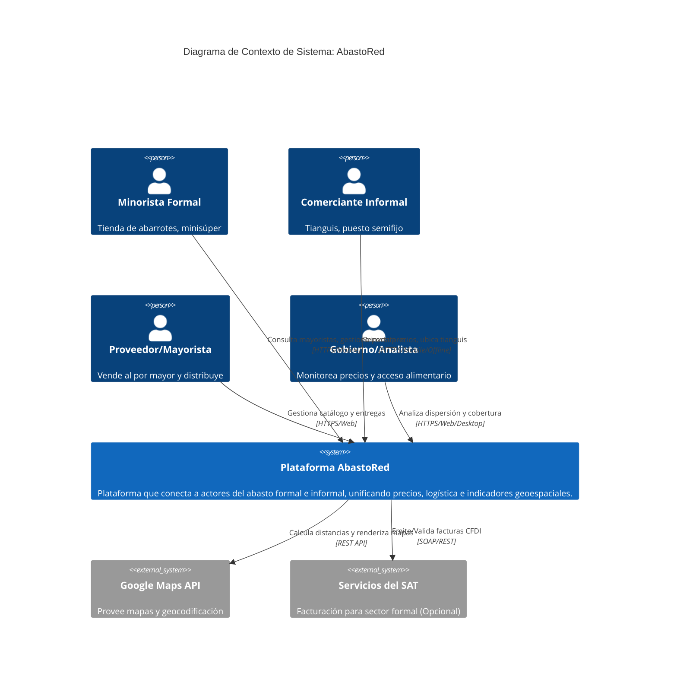
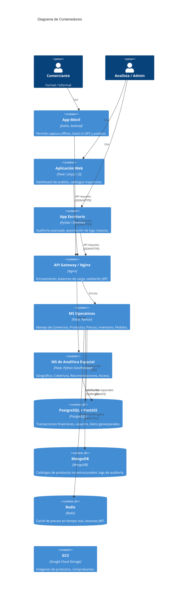
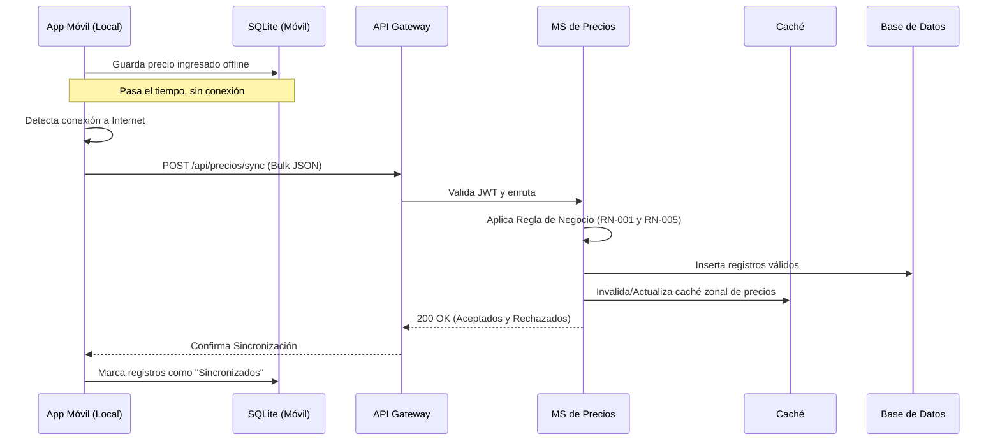
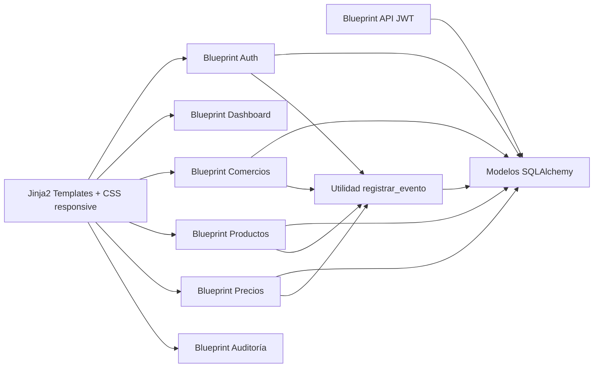
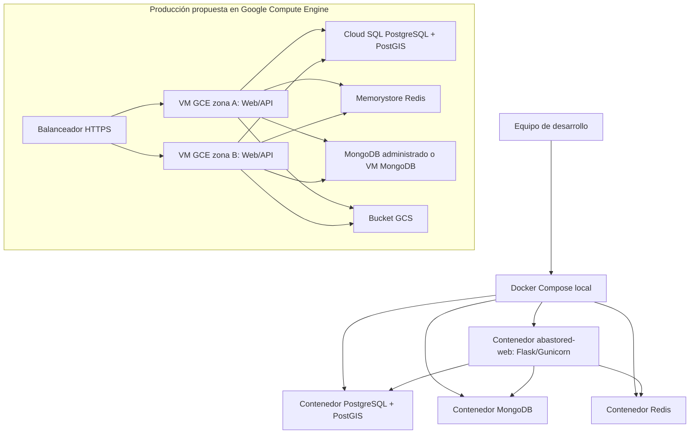
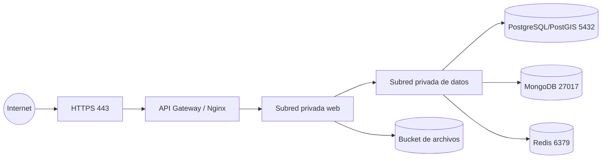
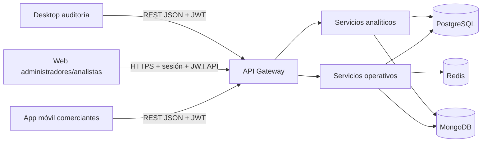
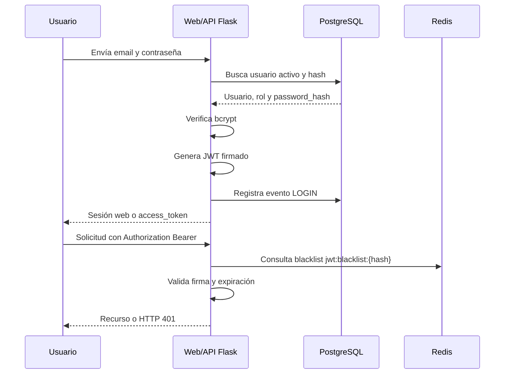
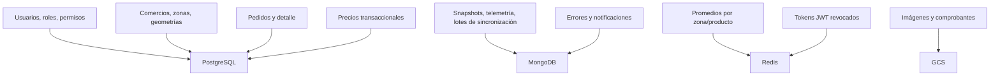

# Diseño y Arquitectura de Software

## Proyecto 14: Plataforma Híbrida para Comercio Formal e Informal

### 1. Diagramas C4

#### Nivel 1: Diagrama de Contexto

#### Nivel 2: Diagrama de Contenedores

### 2. Diagramas de Secuencia

#### Flujo: Registro de Precios Offline a Online

### 3. Justificación Tecnológica

*   **Aplicación Web (Flask/Jinja2)**: Permite renderizado rápido del lado del servidor (SSR) en paneles de administración para gobierno, evitando la sobrecarga de SPAs complejas donde el SEO no es necesario.
*   **Microservicios (Flask REST)**: Python facilita la integración directa con librerías matemáticas y geoespaciales (Pandas, GeoPandas) necesarias para los MS Analíticos, además de tener un desarrollo ágil y bajo overhead usando contenedores.
*   **Persistencia Políglota**:
    *   *PostgreSQL (+ PostGIS)*: Esencial por sus capacidades ACID robustas para el manejo de "Pedidos" e "Inventarios", y PostGIS es el estándar de la industria para cálculos geoespaciales (intersección de polígonos de tianguis, buffers).
    *   *MongoDB*: Ideal para "Catálogos de Productos" debido a que los atributos de los productos varían enormemente (tallas, pesos, marcas, caducidades) y para "Logs de Auditoría" por su alta velocidad de escritura desestructurada.
    *   *Redis*: Utilizado para mantener el estado de los tokens JWT, carritos de compra temporales, y cachear los precios promedio diarios, reduciendo masivamente la carga de la base de datos principal.
*   **Infraestructura (Docker + GCE)**: El uso de contenedores asegura que el ambiente de desarrollo sea idéntico al de producción. Google Compute Engine provee un balance adecuado entre control (IaaS) y costo, comparado con clústeres manejados como GKE que podrían ser muy costosos para un proyecto de este volumen inicial.

### 4. Diagrama de Componentes del Sistema Web

### 5. Diagrama de Despliegue

### 6. Diagrama de Red

Reglas de red propuestas:
*   Solo el gateway público acepta tráfico externo.
*   PostgreSQL, MongoDB y Redis no se exponen a Internet.
*   El acceso administrativo se realiza por VPN o túnel seguro.
*   Las contraseñas y llaves JWT se inyectan por variables de entorno o gestor de secretos.

### 7. Diagrama de Comunicación Entre Aplicaciones

### 8. Diagrama de Autenticación

### 9. Diagrama de Almacenamiento de Datos

### 10. Distribución de Responsabilidades

*   **Sistema web:** autenticación, panel por perfil, catálogos, comparación de precios, auditoría básica y administración operativa.
*   **Microservicios:** precios masivos, alertas, recomendaciones, acceso alimentario, sincronización offline y procesos de alta carga.
*   **PostgreSQL:** usuarios, roles, comercios, productos maestros, precios, pedidos, auditoría transaccional y geometrías PostGIS.
*   **MongoDB:** lotes de sincronización, snapshots analíticos, telemetría geográfica, errores y notificaciones flexibles.
*   **Redis:** blacklist de JWT, caché de promedios, contadores de rate limit, bloqueos temporales y datos efímeros.
*   **Buckets:** imágenes de productos/comercios, comprobantes y exportaciones.
*   **Contenedores:** web, PostgreSQL/PostGIS, MongoDB, Redis y futuros microservicios.
*   **Compute Engine:** ejecución inicial de contenedores web/API; el clúster queda reservado para analítica geoespacial o sincronizaciones masivas cuando el volumen lo justifique.
