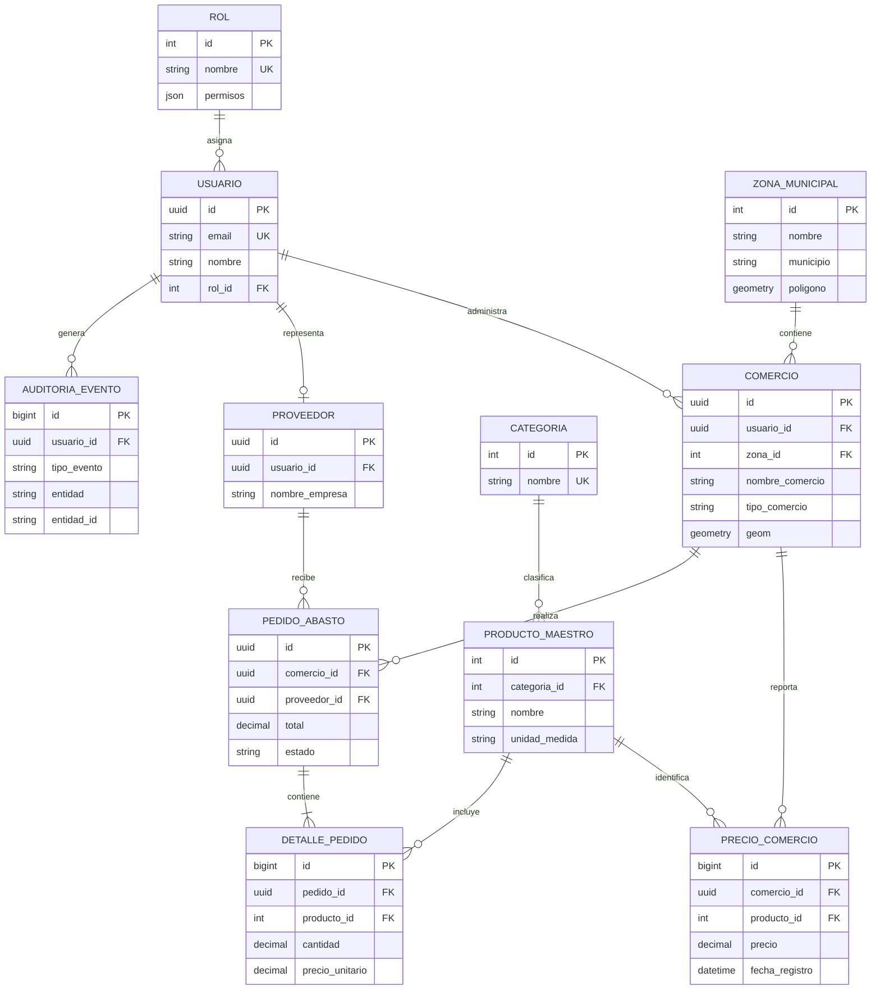

# Diseño de Base de Datos y Almacenamiento

## Proyecto 14: Plataforma Híbrida para Comercio Formal e Informal

### 1. Modelo Conceptual (PostgreSQL - Entidades Relacionales)


El modelo conceptual se encuentra alineado con el modelo físico inicial de PostgreSQL. Los identificadores de usuarios, comercios, proveedores y pedidos utilizan UUID, mientras que los catálogos utilizan identificadores enteros.

En el PMF, PostgreSQL conserva las referencias maestras utilizadas por los procesos transaccionales. MongoDB complementará posteriormente el modelo con atributos variables, snapshots, telemetría y registros generados por microservicios, pero no sustituye las llaves foráneas del flujo actual.

### 2. Diseño de PostgreSQL (Modelo Lógico Espacial y Transaccional)

El motor principal será PostgreSQL utilizando la extensión **PostGIS**.
*   `comercios` (id [PK], usuario_id [FK], nombre, tipo_comercio, latitud, longitud, geom [Geometry(Point, 4326)], created_at). El campo `geom` se indexará usando GIST para búsquedas rápidas por radio.
*   `zonas_municipales` (id [PK], nombre, municipio, poligono [Geometry(Polygon, 4326)], dias_operacion).
*   `pedidos_abasto` (id [PK], comercio_comprador_id, mayorista_vendedor_id, estado, total, fecha_creacion, fecha_entrega).
*   `detalle_pedidos` (id [PK], pedido_id [FK], producto_id [FK], cantidad, precio_unitario).

### 3. Diseño en MongoDB (Documentos y Catálogos Flexibles)

Se utiliza MongoDB por el patrón *Polymorphic Pattern* y *Attribute Pattern*, dado que los productos tienen diferentes características.

**Colección: `catalogo_productos`**
Se usa un enfoque mixto: embeber atributos específicos, referenciar categorías.
```json
{
  "_id": ObjectId("5f8c..."),
  "sku": "LIMON-PER-01",
  "nombre": "Limón Persa 1Kg",
  "categoria_principal": "Frutas y Verduras",
  "unidad_medida": "Kg",
  "atributos": [
    {"k": "origen", "v": "Veracruz"},
    {"k": "calibre", "v": "Mediano"}
  ],
  "imagenes": ["url_gcs_1.jpg"],
  "estado": "activo"
}
```
*Índices en Mongo*: Índice de texto (Text Index) sobre `nombre` y `categoria` para el motor de búsqueda del catálogo.

**Colección: `audit_logs`**
```json
{
  "_id": ObjectId("..."),
  "timestamp": ISODate("2026-09-03T10:00:00Z"),
  "actor_id": 1054,
  "accion": "ACTUALIZAR_PRECIO",
  "entidad_afectada": "PRECIO_ID_884",
  "datos_anteriores": {"valor": 25.50},
  "datos_nuevos": {"valor": 45.00},
  "ip_address": "192.168.1.1",
  "flag_anomalia": true
}
```
#### Estructuras propuestas para las demás colecciones

| Colección | Campos principales | Documentos embebidos y referencias |
| :--- | :--- | :--- |
| `sync_batches` | `schema_version`, `batch_id`, `user_id`, `status`, `created_at`, `processed_at` | Embebe un resumen de registros aceptados y rechazados. `user_id` referencia al UUID de PostgreSQL. |
| `price_snapshots` | `schema_version`, `product_id`, `zone_id`, `average_price`, `min_price`, `max_price`, `sample_size`, `timestamp` | Documento agregado e inmutable. `product_id` y `zone_id` referencian catálogos de PostgreSQL. |
| `geo_telemetry` | `schema_version`, `device_id`, `user_id`, `location`, `timestamp` | `location` se almacena como documento GeoJSON embebido. |
| `error_logs` | `schema_version`, `service`, `level`, `message`, `correlation_id`, `timestamp` | Embebe contexto técnico sanitizado; no almacena contraseñas ni tokens. |
| `notifications` | `schema_version`, `user_id`, `type`, `payload`, `read`, `created_at` | `payload` es un documento embebido y `user_id` referencia al usuario de PostgreSQL. |

#### Estrategia de integración con PostgreSQL

MongoDB no reemplazará las transacciones de PostgreSQL. Los campos como `user_id`, `product_id` y `zone_id` serán referencias lógicas hacia PostgreSQL. La aplicación validará la existencia de esas entidades antes de crear documentos relacionados.

Los documentos incluirán `schema_version` para permitir cambios futuros de estructura. Los snapshots, logs y lotes de sincronización se manejarán principalmente como documentos append-only.

### 4. Diseño de Caché en Redis

Se utiliza Redis para mejorar el rendimiento, evitar recalcular promedios en cada petición y manejar sesiones de forma *stateless*.

1.  **Caché de Precios Promedio (String / Hash)**:
    *   `Key`: `precio_promedio:zona:{id_zona}:producto:{sku}`
    *   `Value`: `35.50`
    *   `TTL`: 4 horas. (Se invalida cuando un MS detecta un cambio drástico o expira para recalcularse mediante un Job en background).
2.  **Tokens Revocados o Sesiones JWT (Set)**:
    *   `Key`: `jwt:blacklist:{token_hash}`
    *   TTL: Mismo tiempo restante de vida del JWT. En el PMF, el token tiene una vigencia máxima de 8 horas; la futura aplicación móvil podrá utilizar una vigencia configurable. 
3.  **Límite de Tasa (Rate Limiting)**:
    *   `Key`: `rate_limit:ip:{ip_address}:ruta:{endpoint}`
    *   `Value`: Contador entero (INCR). TTL: 60 segundos.

### 5. Modelo Físico Inicial Implementado

El modelo físico inicial está definido en `db/postgres/01_schema.sql` y se carga automáticamente al iniciar PostgreSQL desde Docker Compose.

Tablas principales implementadas:
*   `roles`: catálogo de perfiles y permisos en JSONB.
*   `usuarios`: cuentas, credenciales cifradas con bcrypt y rol asignado.
*   `zonas_municipales`: zonas con centro geográfico, radio y polígono PostGIS.
*   `comercios`: comercios formales, informales y mayoristas con punto geográfico PostGIS.
*   `categorias`: catálogo de categorías.
*   `productos_maestros`: catálogo maestro de productos.
*   `precios_comercio`: historial de precios por comercio/producto, estado de validación y método de captura.
*   `proveedores`: datos básicos del mayorista.
*   `pedidos_abasto` y `detalle_pedidos`: pedido y partidas.
*   `auditoria_eventos`: bitácora append-only.
*   `configuracion_sistema`: parámetros globales.

Restricciones e índices relevantes:
*   Llaves primarias en todas las tablas.
*   Llaves foráneas entre usuarios, roles, comercios, precios, productos, pedidos y proveedores.
*   Checks para precios/cantidades positivas y estado de validación.
*   Índices por comercio/producto/fecha en precios.
*   Índices GIST para `comercios.geom` y `zonas_municipales.poligono`.
*   Triggers `updated_at` para entidades modificables.
*   Triggers que bloquean `UPDATE` y `DELETE` en `auditoria_eventos`.

### 6. MongoDB Implementado

El script `db/mongo/init.js` crea colecciones iniciales alineadas al crecimiento futuro:

*   `catalogo_productos`: catálogo flexible con atributos variables por tipo de producto.
*   `audit_logs`: bitácora documental para eventos masivos o provenientes de microservicios.
*   `sync_batches`: lotes de sincronización móvil/offline.
*   `price_snapshots`: snapshots agregados de precios por producto y zona.
*   `geo_telemetry`: telemetría geográfica con índice `2dsphere`.
*   `error_logs`: errores técnicos por servicio.
*   `notifications`: notificaciones pendientes o leídas por usuario.

Estrategia de versionamiento:
*   Los documentos analíticos deberán incluir `schema_version`.
*   Las migraciones se aplicarán por scripts incrementales en `db/mongo/migrations`.
*   Los snapshots se almacenarán como documentos append-only para conservar histórico.

Estrategia de crecimiento:
*   Índices compuestos en consultas frecuentes.
*   TTL indexes futuros para telemetría temporal.
*   Separación por colecciones cuando los documentos crezcan de forma distinta.

### 7. Redis Implementado y Propuesto

Claves iniciales:
*   `precio_promedio:zona:{id_zona}:producto:{id_producto}`: promedio consultado o actualizado por el flujo de precios. TTL: 4 horas.
*   `jwt:blacklist:{token_hash}`: tokens revocados al cerrar sesión. TTL: tiempo restante del JWT.

Claves planeadas:
*   `rate_limit:ip:{ip}:ruta:{endpoint}` para limitar abuso.
*   `lock:sync_batch:{batch_id}` para evitar doble sincronización.
*   `contador:alertas:zona:{id_zona}` para métricas rápidas.

#### Estructuras y tiempos de expiración

| Clave | Tipo | Propósito | TTL |
| :--- | :--- | :--- | :--- |
| `precio_promedio:zona:{id_zona}:producto:{id_producto}` | String | Caché del precio promedio regional. | 4 horas |
| `jwt:blacklist:{token_hash}` | String | Lista de tokens revocados. | Tiempo restante de vigencia del JWT |
| `session:web:{session_id}` | Hash | Información temporal de una sesión web. | 8 horas de inactividad |
| `rate_limit:ip:{ip}:ruta:{endpoint}` | String/contador | Limitar solicitudes repetidas. | 60 segundos |
| `contador:alertas:zona:{id_zona}` | String/contador | Contabilizar alertas por zona. | Según periodo de medición |
| `lock:sync_batch:{batch_id}` | String | Evitar que un lote sea procesado dos veces. | 5 minutos |
| `carrito:{usuario_id}` | Hash | Productos y cantidades de un pedido aún no confirmado. | 24 horas desde la última modificación |
Durante el primer parcial se utilizan Redis para la caché de precios y la revocación básica de JWT. Las sesiones distribuidas, contadores, bloqueos y carritos temporales corresponden a la integración futura con microservicios y aplicaciones móviles.

### 8. Auditoría y Privacidad

Auditoría:
*   Todo login, logout, alta, edición y baja lógica relevante debe crear un registro en `auditoria_eventos`.
*   La tabla es append-only por trigger, por lo que ningún rol puede modificar o eliminar eventos.

Privacidad:
*   Las contraseñas se almacenan con hash bcrypt.
*   Los JWT se firman con `JWT_SECRET_KEY` y se revocan mediante hash del token en Redis.
*   Los datos personales sensibles deberán minimizarse en reportes analíticos y exportaciones.
*   Para producción se recomienda cifrado administrado del disco/base de datos y, si se captura RFC/identificación personal de comerciantes informales, cifrado de campo con AES-256 antes de persistir.
